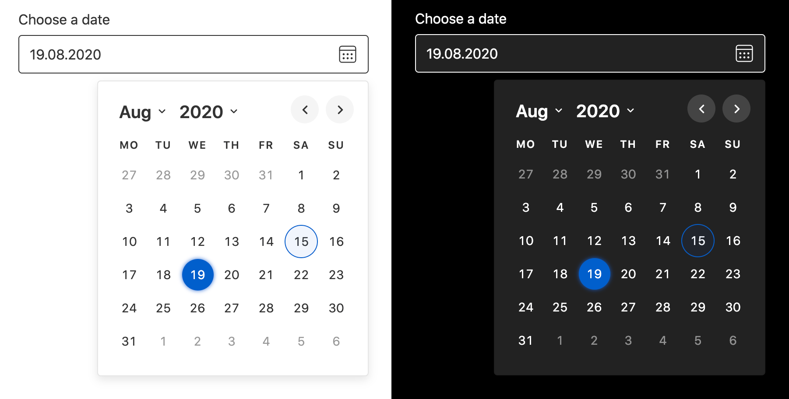

 [](https://www.npmjs.com/package/@duetds/date-picker)  [](https://github.com/prettier/prettier)

# Duet Date Picker

Duet Date Picker is an open source version of Duet Design System’s [accessible date picker](https://www.duetds.com/components/date-picker/). Duet Date Picker can be implemented and used across any JavaScript framework or no framework at all. We accomplish this by using standardized web platform APIs and Web Components.

Why yet another date picker? Our team working on [Duet Design System](https://www.duetds.com/) couldn’t find an existing date picker that would’ve ticked all the requirements we had for accessibility _(supporting WCAG 2.1 as well as we can),_ so we decided to build one and open source it so that others could benefit from this work as well.

Duet Date Picker comes with built-in functionality that allows you to set a minimum and a maximum allowed date. These settings can be combined or used alone, depending on the need. Please note that the date values must be passed in IS0-8601 format: `YYYY-MM-DD`.

**[Read getting started instructions ›](#getting-started)**
<br/>
**[Learn more about Duet ›](https://www.duetds.com)**



## Sections in this documentation:

1. **[Introduction](#duet-date-picker)**
2. **[Live demo](#live-demo)**
3. **[Features](#features)**
4. **[Browser support](#browser-support)**
5. **[Screen reader support](#screen-reader-support)**
6. **[Keyboard support](#keyboard-support)**
7. **[Getting started](#getting-started)**
8. **[Properties](#properties)**
9. **[Events](#events)**
10. **[Methods](#methods)**
11. **[Installation](#installation)**
12. **[Usage with basic HTML](#usage-with-basic-html)**
13. **[Usage with Angular](#usage-with-angular)**
14. **[Usage with Vue.js](#usage-with-vuejs)**
15. **[Usage with React](#usage-with-react)**
16. **[Usage with Ember](#usage-with-ember)**
17. **[IE11 and Edge 17/18 polyfills](#ie11-and-edge-1718-polyfills)**
18. **[Using events](#using-events)**
19. **[Theming](#theming)**
20. **[Localization](#localization)**
21. **[Server side rendering](#server-side-rendering)**
22. **[Single file bundle](#single-file-bundle)**
23. **[Optimizing CDN performance](#optimizing-cdn-performance)**
24. **[Contributing](#contributing)**
25. **[Changelog](#changelog)**
26. **[Roadmap](#roadmap)**
27. **[License](#license)**

## Live demo

- [https://duetds.github.io/date-picker/](https://duetds.github.io/date-picker/)

## Features

- Can be used with any JavaScript framework.
- No external dependencies.
- Weighs only ~10kb minified and Gzip’ed (this includes all styles and icons).
- Built with accessibility in mind.
- Supports all modern browsers and screen readers.
- Additionally, limited support offered for IE11 and Edge 17+.
- Allows theming using CSS Custom Properties.
- Support for localization.
- Customizable date parsing and formatting.
- Support for changing the first day of the week.
- Comes with modified interface for mobile devices to provide better user experience.
- Supports touch gestures for changing months and closing the picker.
- Built using [Stencil.js](https://stenciljs.com/) and Web Components.
- Free to use under the MIT license.

## Browser support

- Google Chrome 61+
- Apple Safari 10+
- Firefox 63+
- Microsoft Edge 17+
- Opera 63+
- Samsung Browser 8.2+
- Internet Explorer 11

## Screen Reader support

We offer support for the following screen readers. For more information about the level of support and possible issues with the implementation, please refer to the included [accessibility audit](https://github.com/duetds/date-picker/blob/master/accessibility-audit.pdf).

- VoiceOver on macOS and iOS
- TalkBack on Android
- NVDA on Windows
- Jaws on Windows

## Keyboard support

Duet Date Picker’s keyboard support is built to closely follow [W3C Date Picker Dialog example](https://www.w3.org/TR/wai-aria-practices/examples/dialog-modal/datepicker-dialog.html) with some small exceptions to e.g. better support iOS VoiceOver and Android TalkBack.

### Choose date button

- `Space, Enter`: Opens the date picker dialog and moves focus to the first select menu in the dialog.

### Date picker dialog

- `Esc`: Closes the date picker dialog and moves focus back to the “choose date” button.
- `Tab`: Moves focus to the next element in the dialog. Please note since the calendar uses `role="grid"`, only one button in the calendar grid is in the tab sequence. Additionally, if focus is on the last focusable element, focus is next moved back to the first focusable element inside the date picker dialog.
- `Shift + Tab`: Same as above, but in reverse order.

### Date picker dialog: Month/year buttons

- `Space, Enter`: Changes the month and/or year displayed.

### Date picker dialog: Date grid

- `Space, Enter`: Selects a date, closes the dialog, and moves focus back to the “Choose Date” button. Additionally updates the value of the Duet Date Picker input with the selected date, and adds selected date to “Choose Date” button label.
- `Arrow up`: Moves focus to the same day of the previous week.
- `Arrow down`: Moves focus to the same day of the next week.
- `Arrow right`: Moves focus to the next day.
- `Arrow left`: Moves focus to the previous day.
- `Home`: Moves focus to the first day (e.g Monday) of the current week.
- `End`: Moves focus to the last day (e.g. Sunday) of the current week.
- `Page Up`: Changes the grid of dates to the previous month and sets focus on the same day of the same week.
- `Shift + Page Up`: Changes the grid of dates to the previous year and sets focus on the same day of the same week.
- `Page Down`: Changes the grid of dates to the next month and sets focus on the same day of the same week.
- `Shift + Page Down`: Changes the grid of dates to the next year and sets focus on the same day of the same week.

### Date picker dialog: Close button

- `Space, Enter`:  Closes the dialog, moves focus to “choose date” button, but does not update the date in input.

## Getting started

Integrating Duet Date Picker to a project without a JavaScript framework is very straight forward. If you’re working on a simple HTML page, you can start using Duet Date Picker immediately by adding these tags to the `<head>`:

```html
<script type="module" src="https://cdn.jsdelivr.net/npm/@duetds/date-picker@1.3.0/dist/duet/duet.esm.js"></script>
<script nomodule src="https://cdn.jsdelivr.net/npm/@duetds/date-picker@1.3.0/dist/duet/duet.js"></script>
<link rel="stylesheet" href="https://cdn.jsdelivr.net/npm/@duetds/date-picker@1.3.0/dist/duet/themes/default.css" />
```

Once included, Duet Date Picker can be used in your markup like any other regular HTML element:

```html
<label for="date">Choose a date</label>
<duet-date-picker identifier="date"></duet-date-picker>
```

**Please note: Importing the CSS file is optional and only needed if you’re planning on using the default theme. See [theming section](#theming) for more information. Additionally, while the above method is the easiest and fastest way to get started, you can also install Duet Date Picker via NPM. Scroll down for the [installation instructions](#installation).**

## Properties

| Property         | Attribute           | Description                                                                                                                                                                                                                                           | Type                                                                                                                                                                                                                                                                                                                                 | Default               |
| ---------------- | ------------------- | ----------------------------------------------------------------------------------------------------------------------------------------------------------------------------------------------------------------------------------------------------- | ------------------------------------------------------------------------------------------------------------------------------------------------------------------------------------------------------------------------------------------------------------------------------------------------------------------------------------ | --------------------- |
| `dateAdapter`    | --                  | Date adapter, for custom parsing/formatting. Must be object with a `parse` function which accepts a `string` and returns a `Date`, and a `format` function which accepts a `Date` and returns a `string`. Default is IS0-8601 parsing and formatting. | `DuetDateAdapter`                                                                                                                                                                                                                                                                                                                    | `isoAdapter`          |
| `direction`      | `direction`         | Forces the opening direction of the calendar modal to be always left or right. This setting can be useful when the input is smaller than the opening date picker would be as by default the picker always opens towards right.                        | `"left" \| "right"`                                                                                                                                                                                                                                                                                                                  | `"right"`             |
| `disabled`       | `disabled`          | Makes the date picker input component disabled. This prevents users from being able to interact with the input, and conveys its inactive state to assistive technologies.                                                                             | `boolean`                                                                                                                                                                                                                                                                                                                            | `false`               |
| `firstDayOfWeek` | `first-day-of-week` | Which day is considered first day of the week? `0` for Sunday, `1` for Monday, etc. Default is Monday.                                                                                                                                                | `DaysOfWeek.Friday \| DaysOfWeek.Monday \| DaysOfWeek.Saturday \| DaysOfWeek.Sunday \| DaysOfWeek.Thursday \| DaysOfWeek.Tuesday \| DaysOfWeek.Wednesday`                                                                                                                                                                            | `DaysOfWeek.Monday`   |
| `identifier`     | `identifier`        | Adds a unique identifier for the date picker input. Use this instead of html `id` attribute.                                                                                                                                                          | `string`                                                                                                                                                                                                                                                                                                                             | `""`                  |
| `localization`   | --                  | Button labels, day names, month names, etc, used for localization. Default is English.                                                                                                                                                                | `{ buttonLabel: string; placeholder: string; selectedDateMessage: string; prevMonthLabel: string; nextMonthLabel: string; monthSelectLabel: string; yearSelectLabel: string; closeLabel: string; calendarHeading: string; dayNames: DayNames; monthNames: MonthsNames; monthNamesShort: MonthsNames; }` | `defaultLocalization` |
| `max`            | `max`               | Maximum date allowed to be picked. Must be in IS0-8601 format: YYYY-MM-DD. This setting can be used alone or together with the min property.                                                                                                          | `string`                                                                                                                                                                                                                                                                                                                             | `""`                  |
| `min`            | `min`               | Minimum date allowed to be picked. Must be in IS0-8601 format: YYYY-MM-DD. This setting can be used alone or together with the max property.                                                                                                          | `string`                                                                                                                                                                                                                                                                                                                             | `""`                  |
| `name`           | `name`              | Name of the date picker input.                                                                                                                                                                                                                        | `string`                                                                                                                                                                                                                                                                                                                             | `"date"`              |
| `role`           | `role`              | Defines a specific role attribute for the date picker input.                                                                                                                                                                                          | `string`                                                                                                                                                                                                                                                                                                                             | `undefined`           |
| `required`       | `required`          | Should the input be marked as required?                                                                                                                                                                                                               | `boolean`                                                                                                                                                                                                                                                                                                                            | `false`               |
| `value`          | `value`             | Date value. Must be in IS0-8601 format: YYYY-MM-DD.                                                                                                                                                                                                   | `string`                                                                                                                                                                                                                                                                                                                             | `""`                  |

## Events

| Event        | Description                                     | Type                                                                                |
| ------------ | ----------------------------------------------- | ----------------------------------------------------------------------------------- |
| `duetBlur`   | Event emitted the date picker input is blurred. | `CustomEvent<{ component: "duet-date-picker"; }>`                                   |
| `duetChange` | Event emitted when a date is selected.          | `CustomEvent<{ component: "duet-date-picker"; valueAsDate: Date; value: string; }>` |
| `duetFocus`  | Event emitted the date picker input is focused. | `CustomEvent<{ component: "duet-date-picker"; }>`                                   |
| `duetOpen`  | Event emitted when the date picker modal is opened. | `CustomEvent<{ component: "duet-date-picker"; }>`                                   |
| `duetClose`  | Event emitted the date picker modal is closed. | `CustomEvent<{ component: "duet-date-picker"; }>`                                   |

## Methods

### `hide(moveFocusToButton?: boolean) => Promise<void>`

Hide the calendar modal. Set `moveFocusToButton` to false to prevent focus
returning to the date picker's button. Default is true.

#### Returns

Type: `Promise<void>`

### `setFocus() => Promise<void>`

Sets focus on the date picker's input. Use this method instead of the global `focus()`.

#### Returns

Type: `Promise<void>`

### `show() => Promise<void>`

Show the calendar modal, moving focus to the calendar inside.

#### Returns

Type: `Promise<void>`

## Installation

Before moving further, please make sure you have [Node.js](https://nodejs.org/en/) installed on your machine. You can install the latest version through [their website](https://nodejs.org/en/). If you’re planning on using Duet Date Picker in a project that doesn’t yet use [Node Package Manager](https://www.npmjs.com), you’ll have to first create a [package.json](https://docs.npmjs.com/files/package.json) file. To do so, run <code>npm init</code> and follow the steps provided.

Once finished, you can install Duet Date Picker by running:

```shell
# WEB COMPONENT for HTML, Ember, Vue.js, React, Angular and Vanilla JS:
npm install @duetds/date-picker
```

## Usage with basic HTML

**Please note: We recommend the usage of CDN like JSDelivr over the below approach if you’re not [server side rendering](#server-side-rendering) Duet Date Picker. See [getting started section](#getting-started) to find the correct script tags.**

Once you’ve installed `@duetds/date-picker` package into your project, it’s recommended to create a copy task that copies Duet Date Picker component from `node_modules` to a location you’ve specified. One such tool that can do this is [NCP](https://www.npmjs.com/package/ncp). You can install `ncp` by running:

```shell
npm install ncp --save-dev
```

Once installed, add a script to your package.json that copies the component library from Duet’s package into a location you’ve specified:

```json
"scripts": {
  "copy:duet-date-picker": "ncp node_modules/@duetds/date-picker/dist src/SPECIFY_PATH"
}
```

You can call this script while starting up your app to make sure you’ve always got the latest code copied over. If you’re using an UNIX-like environment, you can use `&` as the separator:

```json
"start": "copy:duet-date-picker & dev"
```

Otherwise, if you need a cross-platform solution, use [npm-run-all module](https://www.npmjs.com/package/npm-run-all):

```json
"start": "npm-run-all copy:duet-date-picker dev"
```

Once you have a copy task in place and have copied Duet Date Picker over, you can put tags similar to these in the `<head>` of your `index.html` (importing the CSS file is optional and only needed if you’re planning on using the default theme. See [theming section](#theming) for more information):

```html
<script type="module" src="SPECIFY_YOUR_PATH/duet.esm.js"></script>
<script nomodule src="SPECIFY_YOUR_PATH/duet.js"></script>
<link rel="stylesheet" href="SPECIFY_YOUR_PATH/duet.css" />
```

Once included, Duet Date Picker can be used in your basic HTML markup as in the following example:

```html
<label for="date">Choose a date</label>
<duet-date-picker identifier="date"></duet-date-picker>
```

To know when this tag name becomes defined, you can use `window.customElements.whenDefined()`. It returns a Promise that resolves when the element becomes defined:

```js
customElements.whenDefined("duet-date-picker").then(() => {
  document.querySelector("duet-date-picker").show()
});
```

## Usage with Angular

Before you can use Duet Date Picker in Angular, you must import and add Angular’s `CUSTOM_ELEMENTS_SCHEMA`. This allows the use of Web Components in HTML markup, without the compiler producing errors. The `CUSTOM_ELEMENTS_SCHEMA` needs to be included in any module that uses custom elements. Typically, this can be added to `AppModule`:

```js
// ...
// Import custom elements schema
import { CUSTOM_ELEMENTS_SCHEMA } from "@angular/core";

@NgModule({
  // ...
  // Add custom elements schema to NgModule
  schemas: [CUSTOM_ELEMENTS_SCHEMA]
})
export class AppModule { }
```

The final step is to load and register Duet Date Picker in the browser. `@duetds/date-picker` includes a main function that handles this. That function is called `defineCustomElements()` and it needs to be called once during the bootstrapping of your application. One convenient place to do this is in `main.ts` as such:

```js
// Import Duet Date Picker
import { defineCustomElements } from "@duetds/date-picker/dist/loader";
// ...
// Register Duet Date Picker
defineCustomElements(window);
```

Once included, Duet Date Picker can be used in your HTML markup as in the following example:

```html
<label for="date">Choose a date</label>
<duet-date-picker identifier="date"></duet-date-picker>
```

Please note that you need to also import `duet.css` separately if you want to use the default theme. See [theming section](#theming) for more information.

### Accessing using ViewChild and ViewChildren

Once included, components could also be referenced in your code using `ViewChild` and `ViewChildren` as shown in the [Stencil.js documentation](https://stenciljs.com/docs/angular).

## Usage with Vue.js

To integrate `@duetds/date-picker` into a [Vue.js application](https://vuejs.org/), edit `src/main.js` to include:

```js
// Import Duet Date Picker
import { defineCustomElements } from "@duetds/date-picker/dist/loader";

// ...
// configure Vue.js to ignore Duet Date Picker
Vue.config.ignoredElements = [/duet-\w*/];

// Register Duet Date Picker
defineCustomElements(window);

new Vue({
    render: h => h(App)
}).$mount("#app");
```

Once included, Duet Date Picker can be used in your HTML markup as in the following example:

```html
<template>
  <label for="date">Choose a date</label>
  <duet-date-picker
    identifier="date"
    :localization.prop="localisation_uk">
  </duet-date-picker>
</template>

<script>
  const localisation_uk = {
    buttonLabel: 'Choose date',
    placeholder: 'DD/MM/YYYY',
    selectedDateMessage: 'Selected date is',
    prevMonthLabel: 'Previous month',
    nextMonthLabel: 'Next month',
    monthSelectLabel: 'Month',
    yearSelectLabel: 'Year',
    closeLabel: 'Close window',
    calendarHeading: 'Choose a date',
    dayNames: ['Sunday', 'Monday', 'Tuesday', 'Wednesday', 'Thursday', 'Friday', 'Saturday'],
    monthNames: ['January', 'February', 'March', 'April', 'May', 'June', 'July', 'August', 'September', 'October', 'November', 'December'],
    monthNamesShort: ['Jan', 'Feb', 'Mar', 'Apr', 'May', 'Jun', 'Jul', 'Aug', 'Sep', 'Oct', 'Nov', 'Dec'],
  }
</script>
```

Please note that you need to also import `duet.css` separately if you want to use the default theme. See [theming section](#theming) for more information.

Please also note that in order to use duet-date-picker's own custom properties (as seen on the properties section), vue must recognise that such options are being passed down as properties rather than attributes, hence the `.prop` at the end.

## Usage with React

With an application built using the `create-react-app` script the easiest way to include Duet Date Picker is to call `defineCustomElements(window)` from the `index.js` file:

```js
// Import Duet Date Picker
import { defineCustomElements } from "@duetds/date-picker/dist/loader";

// ...
// Register Duet Date Picker
defineCustomElements(window);
```

Then you can create a thin React wrapper component to handle listening for events, cleanup, passing properties etc:

```js
import React, { useEffect, useRef } from "react";

function useListener(ref, eventName, handler) {
  useEffect(() => {
    if (ref.current) {
      const element = ref.current;
      element.addEventListener(eventName, handler)
      return () => element.removeEventListener(eventName, handler)
    }
  }, [eventName, handler, ref])
}

export function DatePicker({
  onChange,
  onFocus,
  onBlur,
  onOpen,
  onClose,
  dateAdapter,
  localization,
  ...props
}) {
  const ref = useRef(null)

  useListener(ref, "duetChange", onChange)
  useListener(ref, "duetFocus", onFocus)
  useListener(ref, "duetBlur", onBlur)
  useListener(ref, "duetOpen", onOpen)
  useListener(ref, "duetClose", onClose)

  useEffect(() => {
    ref.current.localization = localization
    ref.current.dateAdapter = dateAdapter
  }, [localization, dateAdapter])

  return <duet-date-picker ref={ref} {...props}></duet-date-picker>
}
```

Then the wrapper can be used like any other React component:

```js
<DatePicker
  value="2020-08-24"
  onChange={e => console.log(e.detail)}
/>
```

Please note that you need to also import `duet.css` separately if you want to use the default theme. See [theming section](#theming) for more information.

## Usage with Ember

Duet Date Picker can be easily integrated into Ember thanks to the `ember-cli-stencil` addon that handles:

- Importing the required files into your `vendor.js`
- Copying the component definitions into your `assets` directory
- Optionally generating a wrapper component for improved compatibility with older Ember versions

Start by installing the Ember addon:

```shell
ember install ember-cli-stencil ember-auto-import
```

When you build your application, Stencil collections in your dependencies will be automatically discovered and pulled into your application. You might get a ```Can't resolve``` error when building. The easiest way to  resolve that issue is by adding an alias to your  ```ember-cli-build.js``` file.

```js
	autoImport: {
		alias: {
			'@duetds/date-picker/loader':  '@duetds/date-picker/dist/loader/index.cjs',
		},
	},
```
 For more information, see [ember-cli-stencil documentation](https://github.com/alexlafroscia/ember-cli-stencil).

Ember octane example:

```html
<label  for="date">Choose a date.</label>
<duet-date-picker identifier="date" {{prop localization=this.localization}} ></duet-date-picker>
```

```js
import Controller from "@ember/controller";
import { action } from "@ember/object";
import { tracked } from "@glimmer/tracking";

export default class ExampleController extends Controller {
  @tracked localization = {
    buttonLabel: "Choose date",
    placeholder: "mm/dd/yyyy",
    selectedDateMessage: "Selected date is",
    prevMonthLabel: "Previous month",
    nextMonthLabel: "Next month",
    monthSelectLabel: "Month",
    yearSelectLabel: "Year",
    closeLabel: "Close window",
    calendarHeading: "Choose a date",
    dayNames: ["Sunday", "Monday", "Tuesday", "Wednesday", "Thursday", "Friday", "Saturday"],
    monthNames: ["January", "February", "March", "April", "May", "June", "July", "August", "September", "October", "November", "December"],
    monthNamesShort: ["Jan", "Feb", "Mar", "Apr", "May", "Jun", "Jul", "Aug", "Sep", "Oct", "Nov", "Dec"],
  };
}
```


## IE11 and Edge 17/18 polyfills

If you want the Duet Date Picker custom element to work on older browser, you need to add the `applyPolyfills()` that surround the `defineCustomElements()` function:

```js
import { applyPolyfills, defineCustomElements } from "@duetds/date-picker/lib/loader";
// ...
applyPolyfills().then(() => {
  defineCustomElements(window)
})
```

## Using events

We encourage the use of DOM events, but additionally provide custom events to make handling of certain event types easier. All custom events are documented in this same readme [under the “Events” heading](#events).

Duet Date Picker provides e.g. a custom event called `duetChange`. This custom event includes an object called `detail` which includes for example the selected date:

```js
// Select the date picker component
const date = document.querySelector("duet-date-picker")

// Listen for when date is selected
date.addEventListener("duetChange", function(e) {
  console.log("selected date", e.detail.valueAsDate)
})
```

The console output for the above code looks like this:

```shell
selected date Sat Aug 15 2020 00:00:00 GMT+0300 (Eastern European Summer Time)
```

## Theming

Duet Date Picker uses CSS Custom Properties to make it easy to theme the picker. The component ships with a default theme that you can import either from the NPM package or directly from a CDN like JSDelivr:

```html
<link rel="stylesheet" href="https://cdn.jsdelivr.net/npm/@duetds/date-picker@1.3.0/dist/duet/themes/default.css" />
```

The above CSS file provides the following Custom Properties that you can override with your own properties:

```css
:root {
  --duet-color-primary: #005fcc;
  --duet-color-text: #333;
  --duet-color-text-active: #fff;
  --duet-color-placeholder: #666;
  --duet-color-button: #f5f5f5;
  --duet-color-surface: #fff;
  --duet-color-overlay: rgba(0, 0, 0, 0.8);
  --duet-color-border: #333;

  --duet-font: -apple-system, BlinkMacSystemFont, "Segoe UI", Roboto, Helvetica, Arial, sans-serif;
  --duet-font-normal: 400;
  --duet-font-bold: 600;

  --duet-radius: 4px;
  --duet-z-index: 600;
}

```

If you wish to customize any of the default properties shown above, *we recommend to NOT import or link to the provided CSS,* but instead copying the above code into your own stylesheet and replacing the values used there.

Additionally, you’re able to override Duet Date Picker’s default styles by using e.g. `.duet-date__input` selector in your own stylesheet. This allows you to give the form input and e.g. date picker toggle button a visual look that matches the rest of your website.

## Localization

Duet Date Picker offers full support for localization. This includes the text labels and date formats used. Below is an example of a date picker that is using Finnish date format and localization.

```html
<label for="date">Valitse päivämäärä</label>
<duet-date-picker identifier="date"></duet-date-picker>

<script>
  const picker = document.querySelector("duet-date-picker")
  const DATE_FORMAT = /^(\d{1,2})\.(\d{1,2})\.(\d{4})$/

  picker.dateAdapter = {
    parse(value = "", createDate) {
      const matches = value.match(DATE_FORMAT)

      if (matches) {
        return createDate(matches[3], matches[2], matches[1])
      }
    },
    format(date) {
      return `${date.getDate()}.${date.getMonth() + 1}.${date.getFullYear()}`
    },
  }

  picker.localization = {
    buttonLabel: "Valitse päivämäärä",
    placeholder: "pp.kk.vvvv",
    selectedDateMessage: "Valittu päivämäärä on",
    prevMonthLabel: "Edellinen kuukausi",
    nextMonthLabel: "Seuraava kuukausi",
    monthSelectLabel: "Kuukausi",
    yearSelectLabel: "Vuosi",
    closeLabel: "Sulje ikkuna",
    calendarHeading: "Valitse päivämäärä",
    dayNames: [
      "Sunnuntai", "Maanantai", "Tiistai", "Keskiviikko",
      "Torstai", "Perjantai", "Lauantai"
    ],
    monthNames: [
      "Tammikuu", "Helmikuu", "Maaliskuu", "Huhtikuu",
      "Toukokuu", "Kesäkuu", "Heinäkuu", "Elokuu",
      "Syyskuu", "Lokakuu", "Marraskuu", "Joulukuu"
    ],
    monthNamesShort: [
      "Tammi", "Helmi", "Maalis", "Huhti", "Touko", "Kesä",
      "Heinä", "Elo", "Syys", "Loka", "Marras", "Joulu"
    ],
    locale: "fi-FI",
  }
</script>
```

Please note that you must provide the entirety of the localization properties in the object when overriding with your coustom localization.

## Control which days are selectable

Duet Date Picker allows you to disable the selection of specific days. Below is an example of a date picker that is disabling weekends.

Be aware, this only disables selection of dates in the popup calendar. You must still handle the case where a user manually enters a disallowed date into the input.

```html
<label for="date">Choose a date</label>
<duet-date-picker identifier="date"></duet-date-picker>

<script>
  function isWeekend(date) {
    return date.getDay() === 0 || date.getDay() === 6
  }

  const pickerDisableWeekend = document.querySelector("duet-date-picker")
  pickerDisableWeekend.isDateDisabled = isWeekend

  pickerDisableWeekend.addEventListener("duetChange", function(e) {
    if (isWeekend(e.detail.valueAsDate)) {
      alert("Please select a weekday")
    }
  })
</script>
```

## Server side rendering

Duet Date Picker package includes a hydrate app that is a bundle of the same components, but compiled so that they can be hydrated on a NodeJS server and generate static HTML and CSS. To get started, import the hydrate app into your server’s code like so:

```js
import hydrate from "@duetds/date-picker/hydrate"
```

If you are using for example [Eleventy](https://www.11ty.dev/), you could now add a transform into `.eleventy.js` configuration file that takes content as an input and processes it using Duet’s hydrate app:

```js
eleventyConfig.addTransform("hydrate", async(content, outputPath) => {
  if (process.env.ELEVENTY_ENV == "production") {
    if (outputPath.endsWith(".html")) {
      try {
        const results = await hydrate.renderToString(content, {
          clientHydrateAnnotations: true,
          removeScripts: false,
          removeUnusedStyles: false
        })
        return results.html
      } catch (error) {
        return error
      }
    }
  }
  return content
})
```

The above transform gives you server side rendered components that function without JavaScript. Please note that you need to separately pre-render the content for each theme you want to support.

## Single file bundle

Duet Date Picker also offers a single file bundle without the polyfills and other additional functionality included in the default output. To import that instead of the default output, use:

```jsx
import { DuetDatePicker } from "@duetds/date-picker/custom-element";

customElements.define("duet-date-picker", DuetDatePicker);
```

Please note that this custom-element output does not automatically define the custom elements or apply any polyfills which is why we’re defining the custom element above ourselves.

For more details, please see [Stencil.js documentation](https://stenciljs.com/docs/custom-elements).

## Optimizing CDN performance

If you wish to make sure Duet Date Picker shows up as quickly as possible when loading the scripts from JSDelivr CDN, you can preload the key parts using link `rel="preload"`. To do this, add these tags in the `<head>` of your webpage before any other `<script>` or `<link>` tags:

```html
<link rel="preload" href="https://cdn.jsdelivr.net/npm/@duetds/date-picker@1.3.0/dist/duet/duet.esm.js" as="script" crossorigin="anonymous" />
<link rel="preload" href="https://cdn.jsdelivr.net/npm/@duetds/date-picker@1.3.0/dist/duet/duet-date-picker.entry.js" as="script" crossorigin="anonymous" />
```

In case you’re also using one of the included themes, you can preload them the same way using the below tag:

```html
<link rel="preload" href="https://cdn.jsdelivr.net/npm/@duetds/date-picker@1.3.0/dist/duet/themes/default.css" as="style" />
```

## Contributing

### Development server

- Clone the repository by running `git clone git@github.com:duetds/duet-date-picker.git`.
- Once cloned, open the directory and run `npm install`.
- Run `npm start` to get the development server and watch tasks up and running. This will also automatically open a new browser window with an example page.
- To edit the example page’s source, see `./src/index.html`.

### Testing and building

- To run the unit, end-to-end and visual diff tests use `npm run test`.
- To build the project use `npm run build`.

### Publishing the package

_**NOTE:** this section is for maintainers and can be ignored by contributors._

The process for publishing a stable or a beta release differs.

To publish a new _stable_ release, use the `npm version` command. The npm docs for the [version command](https://docs.npmjs.com/cli/v6/commands/npm-version) explains in detail how this command works.

E.g. to publish a new minor version:

```sh
npm version minor
```

This will run tests, build the project, bump the minor version in package.json, commit and tag the changes, publish to npm, and finally push any commits to github.

To publish a new _beta_ release, do the following:

1. Bump version in `package.json` and elsewhere.
1. Commit your changes.
1. Tag new release by running `git tag -a 1.2.0-beta.0 -m "1.2.0-beta.0"`.
1. Push your changes to Git and then run `npm publish --tag beta`.
1. Push to git: `git push --tags --no-verify`.

## Changelog

- `1.3.0`:
    - Add new theme variable `--duet-border-color` for customising the input's border color. Falls back to previous value `--duet-color-text` if not set ([#70](https://github.com/duetds/date-picker/pull/70)).
    - Improve handling of disallowed characters so that cursor position is maintained.
    - Add new `duetOpen` and `duetClose` events to correspond with opening and closing the calendar ([#73](https://github.com/duetds/date-picker/pull/73)).
    - Fix click outside logic so that it works when nested in a shadow DOM ([#65](https://github.com/duetds/date-picker/pull/65)).
- `1.2.0`:
    - Improvements to screen reader accessibility.
        - Ensure table can be navigated with table navigation commands.
        - Ensure column headers are announced out when navigating table columns.
        - Ensure month/year is announced whenever it changes.
        - Improve how dates are presented to screen readers. Use formats like "17 November 2020" instead of "2020-11-17".
    - Year dropdown now shows every year that satisfies min/max range.
- `1.1.0`: Adds support for `required` attribute. Ensures date is always submitted in ISO format. Updates @stencil/core to 2.3.0.
- `1.0.4`: Improves stability for NVDA + Chrome on Windows. Also fixes an issue which caused build attempts to fail due to snapshot mismatch.
- `1.0.2`: Documentation improvements.
- `1.0.1`: Hitting arrow keys on year select on Windows without first opening the dropdown previously causes odd results. This is now fixed.
- `1.0.0`: Initial release.

## Roadmap

- Better examples on how to do date ranges, handle validation and so on.
- Better theming and basic code examples.
- Making it possible to pass in your own input component.

## License

Copyright © 2020 LocalTapiola Services Ltd / [Duet Design System](https://www.duetds.com).

Licensed under the [MIT license](https://github.com/duetds/date-picker/blob/master/LICENSE).
